# Brownian Motion in Financial Markets

This project tests whether the assumptions of Brownian motion hold in real stock markets. We study two contrasting stocks: AAPL (a stable large-cap) and GME (a highly volatile meme stock), testing the three core properties of Brownian motion: Gaussian increments, independent increments, and variance growing linearly with time.

## Background

Brownian motion was first observed in 1827 by the botanist Robert Brown, who noticed pollen particles jittering randomly in water. In 1905, Einstein explained it: each particle is struck from all directions by countless water molecules, taking a tiny random step each time, and these steps accumulate into the erratic motion.

This idea of countless random steps accumulating naturally raises a question about financial markets: are stock prices also random and unpredictable, like pollen in water? In 1900, the mathematician Louis Bachelier was the first to model stock prices with Brownian motion, an idea that later became the foundation of the Black-Scholes option pricing model, still a cornerstone of finance today.

But are real markets truly this random? This project explores that question, using real stock data to test where the assumptions of Brownian motion hold, and where they break down.

## Part 1: From Random Walk to Brownian Motion

Brownian motion isn't introduced out of nowhere. It's built step by step from the simplest idea of randomness.

### 1. Normal Distribution

The normal distribution describes the "shape" of randomness. Its key feature: values cluster in the middle and thin out at the edges, because there are far more ways to land near the center than at the extremes. This is the distribution that every increment of Brownian motion follows.

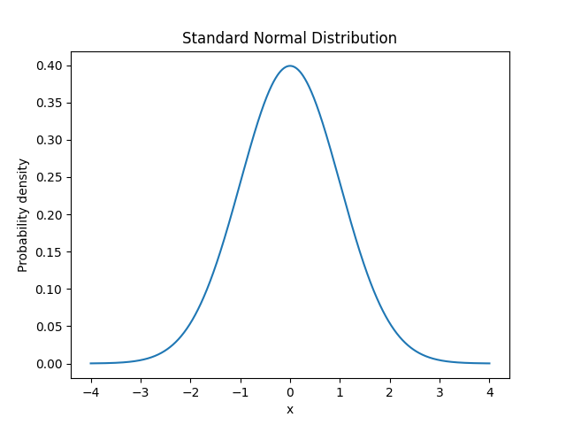

### 2. Random Walk

A random walk takes a step of +1 or -1 at each moment and adds them up. The path looks erratic and directionless, much like a stock chart. This is the discrete starting point: Brownian motion is what a random walk becomes when the steps get infinitely small and frequent.

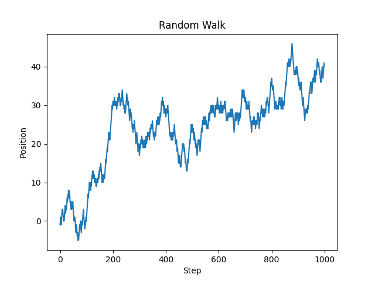

### 3. Central Limit Theorem

Run a random walk many times and collect the final position (a sum of many random steps) each time. The distribution of these sums is normal. This is the Central Limit Theorem, and it is the reason Brownian motion's increments are Gaussian: any increment is a sum of countless tiny independent steps.

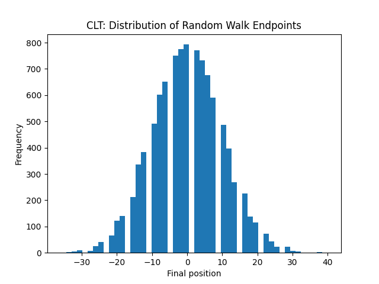

### 4. Brownian Motion

Splitting a fixed time interval into more and more steps, each scaled by sqrt(dt), the random walk becomes a continuous path. The sqrt(dt) scaling keeps the path from blowing up as steps shrink. The result is continuous but never smooth, and its variance grows linearly with time (longer horizon, wider spread).

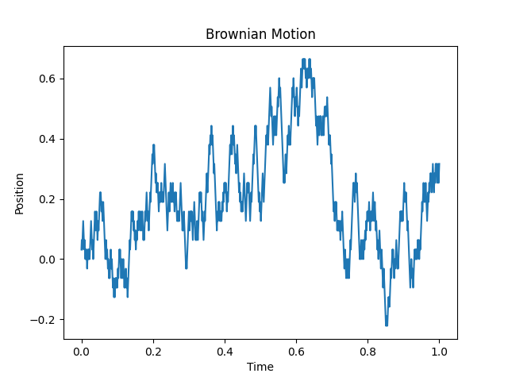

## Part 2: Testing on Real Stocks

Brownian motion describes the behaviour of its increments. To test it on stocks, we assume that the log price of a stock behaves like Brownian motion, so that the daily log return corresponds to a Brownian increment. Under this assumption, the three properties translate into testable predictions about daily log returns:

1. **Gaussian increments**: log returns follow a normal distribution
2. **Independent increments**: today's return can't predict tomorrow's
3. **Linear variance**: variance grows in proportion to the time horizon

### Why log returns?

We use log returns (the difference of log prices) rather than simple percentage returns because of one key property: **they are additive**. The return over several days is simply the sum of the daily log returns (percentage returns would have to be multiplied instead).

This additivity is exactly what matches Brownian motion: a Brownian path is built as a cumulative sum of increments, and log prices accumulate the same way (today's log price = previous log price + today's log return). This structural match is what makes log returns the right quantity to test against the model.

We test these on two stocks from 2020 to 2026: AAPL (a stable large-cap) and GME (a meme stock that spiked dramatically in early 2021).

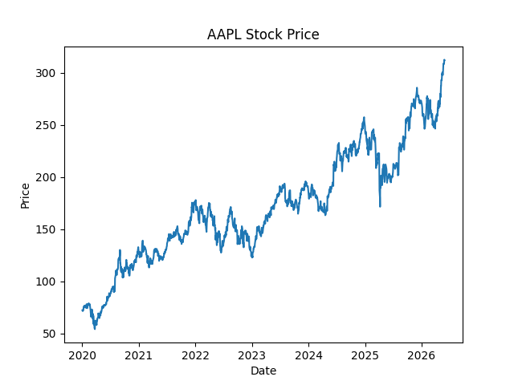
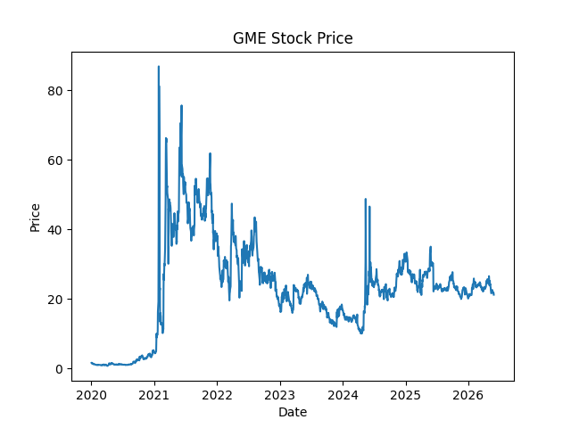

AAPL grows steadily with moderate swings, while GME shows an extreme spike in early 2021 followed by high volatility. 

GME's spike in particular has a story behind it. In January 2021, GameStop was a struggling game retailer that many hedge funds were shorting. Retail traders on Reddit's WallStreetBets started buying the stock together. As the price rose, short sellers had to buy back shares to cut their losses, which pushed the price even higher. The stock went from under $20 to $483 in a few weeks, then crashed. This is why GME is a good test case: its price was driven by crowd behaviour, not fundamentals.

### Property 1: Are returns normally distributed?

We compute daily log returns for each stock, plot their distribution, and overlay a normal curve fitted with the stock's own mean and standard deviation. Fitting the curve to each stock's own spread lets us compare the *shape* of the distribution, not its width.

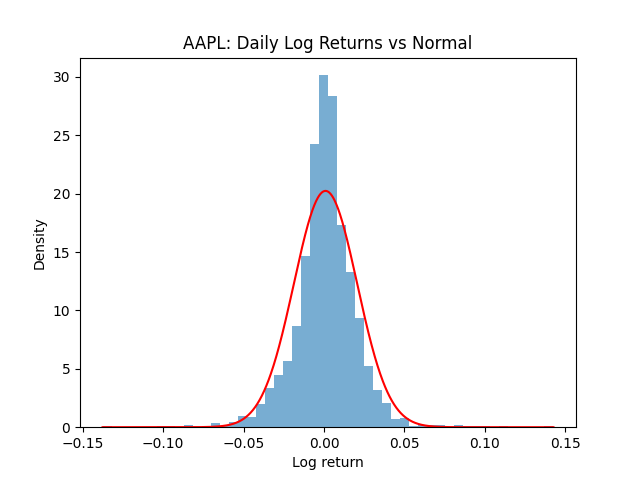
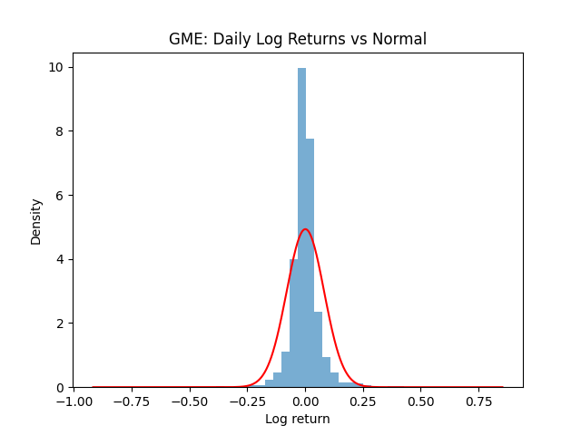

Both distributions are bell-shaped and roughly symmetric, but neither is perfectly normal: the peak is sharper and the tails are heavier than the normal curve predicts. These heavy tails (fat tails) mean extreme moves happen more often than a normal distribution allows.

To measure this objectively, we use kurtosis (normal = 0; higher means fatter tails):

| Stock | Kurtosis |
|-------|----------|
| AAPL  | 6.5      |
| GME   | 33.4     |

A key observation: by eye, GME's fat tails are not obviously worse than AAPL's, because GME's huge volatility stretches its fitted normal curve very wide, hiding the extremes. Kurtosis removes this distortion and shows the truth: GME's tails are far heavier. Visual fit alone is misleading; the number is what reveals it.

### Property 2: Are returns independent over time?

Independence means today's return tells us nothing about tomorrow's. This has two aspects, and testing only one is insufficient: the **direction** of a move (up or down), and its **magnitude** (how large, regardless of sign). We test both.

**Direction.** We plot each day's return against the previous day's and measure their correlation. A value near zero indicates today's direction cannot predict tomorrow's.

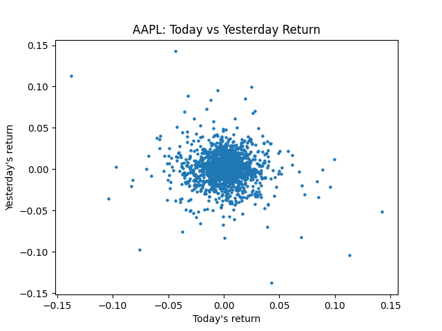
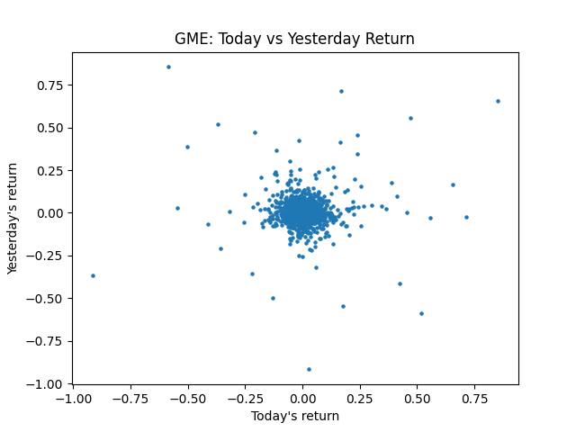

| Stock | Direction correlation |
|-------|----------------------|
| AAPL  | -0.08                |
| GME   | 0.02                 |

Both values are near zero, so in terms of direction, both stocks appear independent.

**Magnitude.** A large move may still be followed by another large move regardless of sign, a pattern the direction correlation cannot detect. To test it, we take the absolute value of returns (removing direction, keeping only size) and measure its correlation:

| Stock | Magnitude correlation |
|-------|----------------------|
| AAPL  | 0.25                 |
| GME   | 0.45                 |

Both values are clearly positive: large moves tend to follow large moves. This is volatility clustering, a genuine dependence that the direction correlation entirely misses, and it is far stronger in GME.

Returns are therefore independent in direction but not in magnitude. Brownian motion assumes full independence, which does not hold for either stock, and especially not for GME.

### Property 3: Does variance grow linearly with time?

Brownian motion predicts that the variance of an n-day return is n times the variance of a 1-day return, so variance should grow linearly with the time horizon. We compute the variance of n-day log returns for n from 1 to 20 and plot it against n. A straight line supports the prediction; a curve signals a deviation.

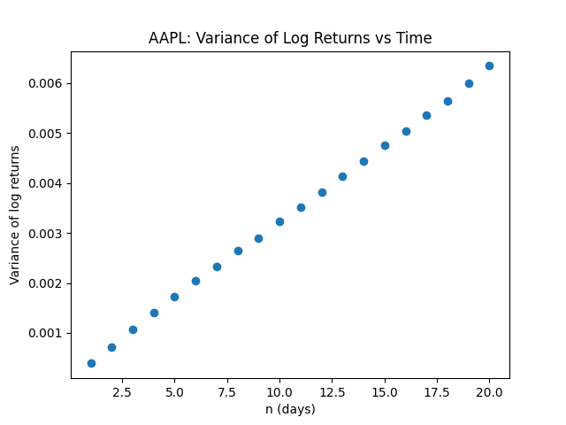
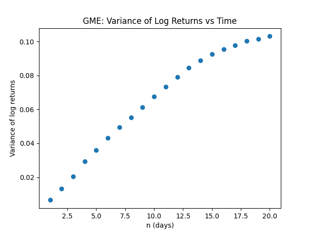

For AAPL, the points fall almost perfectly on a straight line through the origin: variance grows linearly, exactly as Brownian motion predicts.

For GME, the points fall increasingly below the line. The main reason is that GME's huge moves in 2021 tend to reverse: large positive and negative returns partially cancel out within longer windows, so the longer the window, the less the 2021 spike matters. The reference line, however, is scaled from the single-day variance, which the spike inflated. So the line keeps growing at full speed while the actual variance falls behind.

AAPL satisfies Property 3 cleanly; GME clearly deviates.

## Conclusion

Testing the three properties on AAPL and GME gives a clear contrast:

| Property | AAPL | GME |
|----------|------|-----|
| 1. Gaussian increments | Roughly normal, mild fat tails (kurtosis 6.5) | Severe fat tails (kurtosis 33.4) |
| 2. Independent increments | Independent in direction, mild volatility clustering | Independent in direction, strong volatility clustering |
| 3. Linear variance | Almost perfectly linear | Bends downward (mean reversion, time-varying volatility) |

Across the three properties, the same pattern holds: Brownian motion is a good approximation for ordinary stocks like AAPL, but loses accuracy for irregular ones like GME, where fat tails and shifting volatility dominate. This is not a flaw in Brownian motion itself, which was built to describe a different kind of randomness. Rather, it marks the boundary of where the model applies to markets, and shows what a more specialised model, designed for financial data, would need to capture on top of it: the extreme events and clustered volatility that real stocks exhibit but Brownian motion does not.

And maybe that boundary is the interesting part. Where a clean model stops fitting is where real markets reveal how rich and unpredictable they truly are.